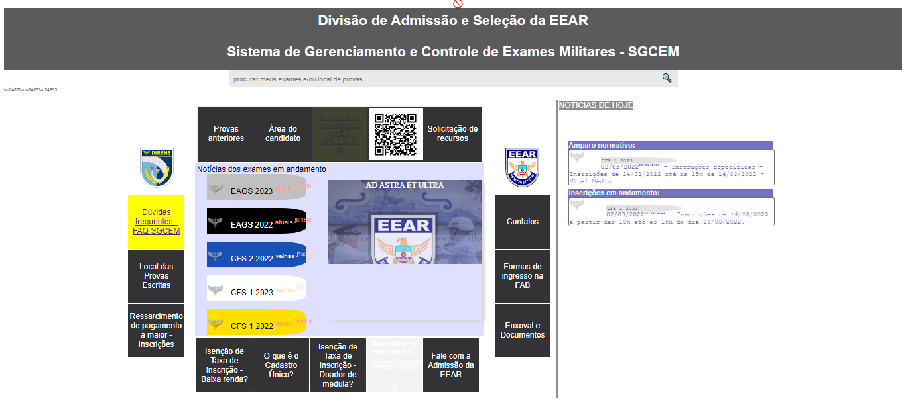
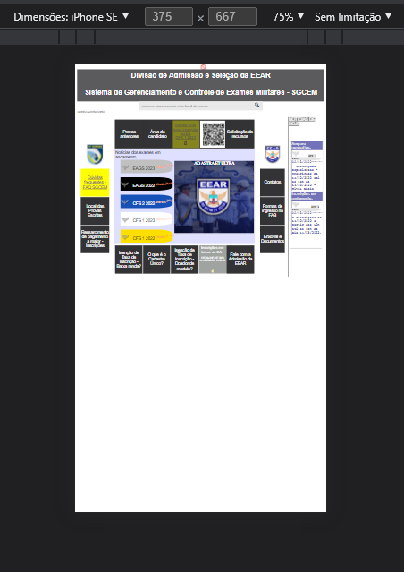
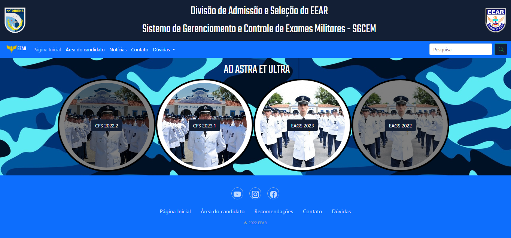
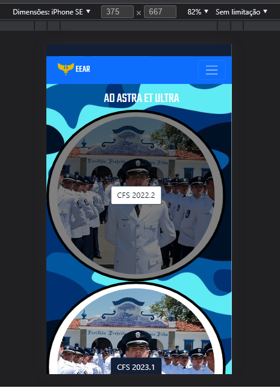

# EEAR
<strong>Before (their official website):</strong> 
 
<strong>Not responsive at all:</strong> 
 
<strong>After: (80% zoom)</strong> 
 
<strong>Responsive :)</strong> 
 
<strong>Responsive :)</strong> 

